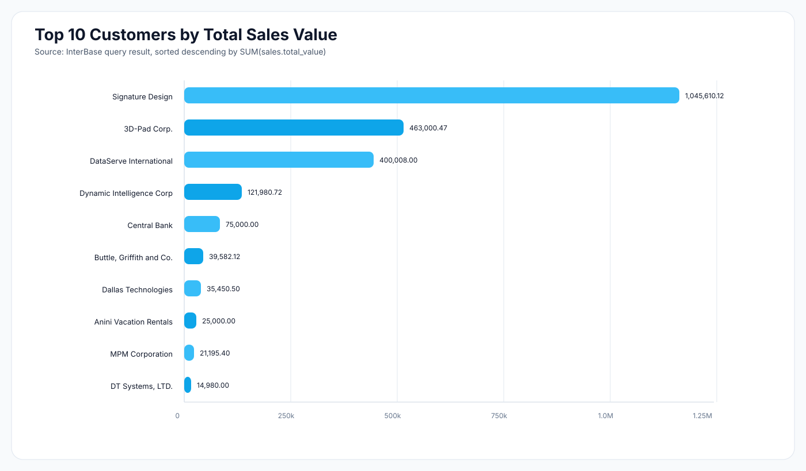

# Exploring an InterBase Database with an MCP-Driven Workflow

*A practical report on schema discovery, ER modeling, analytics, visualization, and query-plan experiments.*

On July 31, 2026, we used an InterBase MCP integration to explore a sample business database from end to end. The work began with catalog discovery and gradually moved into schema documentation, visual modeling, analytical SQL, dashboard generation, and performance testing.

This article reconstructs those experiments, with the original requests rewritten as more natural English. It reports the observed results, including the approaches that failed and the performance changes that did not materialize.

## 1. Discovering the schema

> **Prompt:** List all tables in the database, then show each table's columns, data types, nullability, primary keys, foreign keys, and indexes.

The database contains ten user tables:

| Table | Primary key | Purpose |
| --- | --- | --- |
| `COUNTRY` | `COUNTRY` | Country and currency reference data |
| `CUSTOMER` | `CUST_NO` | Customer contact and location data |
| `DEPARTMENT` | `DEPT_NO` | Organizational hierarchy and budgets |
| `EMPLOYEE` | `EMP_NO` | Employees, jobs, departments, and salaries |
| `EMPLOYEE_PROJECT` | `EMP_NO, PROJ_ID` | Employee-to-project bridge |
| `JOB` | `JOB_CODE, JOB_GRADE, JOB_COUNTRY` | Job definitions and salary ranges |
| `PROJECT` | `PROJ_ID` | Projects, products, and team leaders |
| `PROJ_DEPT_BUDGET` | `FISCAL_YEAR, PROJ_ID, DEPT_NO` | Project budgets by department and year |
| `SALARY_HISTORY` | `EMP_NO, CHANGE_DATE, UPDATER_ID` | Employee salary changes |
| `SALES` | `PO_NUMBER` | Orders, sales representatives, quantities, and values |

The catalog inspection identified 13 foreign-key relationships. The central transactional table is `SALES`, which references `CUSTOMER` through `CUST_NO` and `EMPLOYEE` through `SALES_REP`. The employee, department, job, and project tables form the core organizational model.

The complete column-level output was saved as [schema-document.md](./schema-document.md). It includes data types, nullability, defaults, constraints, indexes, and a relationship summary.

### Main relationships

- `CUSTOMER.COUNTRY` references `COUNTRY.COUNTRY`.
- `SALES.CUST_NO` references `CUSTOMER.CUST_NO`.
- `SALES.SALES_REP` references `EMPLOYEE.EMP_NO`.
- `EMPLOYEE.DEPT_NO` references `DEPARTMENT.DEPT_NO`.
- The employee job columns reference the composite primary key in `JOB`.
- `DEPARTMENT` has a self-reference through `HEAD_DEPT`.
- `EMPLOYEE_PROJECT` resolves the many-to-many relationship between employees and projects.
- `PROJ_DEPT_BUDGET` connects projects and departments at a fiscal-year grain.
- `SALARY_HISTORY.EMP_NO` references `EMPLOYEE.EMP_NO`.

## 2. Generating the schema document and ER diagram

> **Prompt:** Generate a Markdown schema document, then create a hierarchical ER diagram showing every column, data type, nullability rule, primary key, and foreign-key relationship.

The first diagram attempts exposed a useful Mermaid-specific lesson. Free-form annotations for keys and nullability caused syntax errors. Mermaid ER entities expect `PK` and `FK` as key markers in attribute definitions, while relationships must be expressed through Mermaid relationship lines. Nullability text also has to remain compatible with the renderer's ER grammar.

After correcting the entity syntax and relationship definitions, the diagram was rendered as SVG with a hierarchical layout and the Catppuccin Latte theme.


The final artifacts are:

- [schema-er.mmd](./schema-er.mmd), the Mermaid source.
- [schema-er.svg](./schema-er.svg), the rendered vector diagram.

SVG was a good fit for this schema because labels remain sharp while zooming, even with every column displayed.

## 3. Inspecting customer data

> **Prompt:** Show the data stored in the `CUSTOMER` table.

The table contained 15 customers. The following compact view shows the identifying and location fields retrieved during the experiment:

| Customer no. | Customer | City | Region | Country | On hold |
| ---: | --- | --- | --- | --- | :---: |
| 1001 | Signature Design | San Diego | CA | USA |  |
| 1002 | Dallas Technologies | Dallas | TX | USA | `*` |
| 1003 | Buttle, Griffith and Co. | Boston | MA | USA |  |
| 1004 | Central Bank | Manchester |  | England |  |
| 1005 | DT Systems, LTD. | Central Hong Kong |  | Hong Kong |  |
| 1006 | DataServe International | Ottawa | ON | Canada |  |
| 1007 | Mrs. Beauvais | Pebble Beach | CA | USA |  |
| 1008 | Anini Vacation Rentals | Lihue | HI | USA |  |
| 1009 | Max | Turtle Island |  | Fiji | `*` |
| 1010 | MPM Corporation | Tokyo |  | Japan |  |
| 1011 | Dynamic Intelligence Corp | Zurich |  | Switzerland |  |
| 1012 | 3D-Pad Corp. | Paris |  | France |  |
| 1013 | Lorenzi Export, Ltd. | Milan |  | Italy |  |
| 1014 | Dyno Consulting | Brussels |  | Belgium |  |
| 1015 | GeoTech Inc. | Den Haag |  | Netherlands |  |

Two customers, Dallas Technologies and Max, were marked as on hold.

## 4. Finding the top customers by sales value

> **Prompt:** Write and run an InterBase query that returns the ten customers with the highest total sales value.

The working InterBase query was:

```sql
SELECT
    c.cust_no,
    c.customer,
    SUM(s.total_value) AS total_sales_value
FROM customer c
JOIN sales s
    ON s.cust_no = c.cust_no
GROUP BY
    c.cust_no,
    c.customer
ORDER BY
    total_sales_value DESC
ROWS 1 TO 10
```

`ROWS 1 TO 10` was accepted by this InterBase environment. An earlier `FIRST 10` variant was not.

### Result

| Rank | Customer no. | Customer | Total sales value |
| ---: | ---: | --- | ---: |
| 1 | 1001 | Signature Design | 1,045,610.12 |
| 2 | 1012 | 3D-Pad Corp. | 463,000.47 |
| 3 | 1006 | DataServe International | 400,008.00 |
| 4 | 1011 | Dynamic Intelligence Corp | 121,980.72 |
| 5 | 1004 | Central Bank | 75,000.00 |
| 6 | 1003 | Buttle, Griffith and Co. | 39,582.12 |
| 7 | 1002 | Dallas Technologies | 35,450.50 |
| 8 | 1008 | Anini Vacation Rentals | 25,000.00 |
| 9 | 1010 | MPM Corporation | 21,195.40 |
| 10 | 1005 | DT Systems, LTD. | 14,980.00 |

Signature Design was the clear leader, accounting for more than twice the sales value of the second-ranked customer.

> **Prompt:** Present the same result as a chart.



The chart was saved as [top-customers-chart.svg](./top-customers-chart.svg).

## 5. Building a database dashboard

> **Prompt:** Create a dashboard that summarizes the database's most relevant operational and analytical data.

The resulting [database-dashboard.html](./database-dashboard.html) combined schema counts, sales KPIs, order status, customer geography, top customers, employee salary statistics, department headcount, and table row counts.

The captured dashboard metrics were:

| Metric | Result |
| --- | ---: |
| User tables | 10 |
| `SALES` rows | 33 |
| Total sales value | Approximately 2.25 million |
| Distinct customers with sales | 15 |
| Average sale | Approximately 68.2 thousand |
| Maximum sale | 560 thousand |
| Employees | 42 |

The order-status breakdown was 21 shipped orders worth about 1.68 million, eight open orders worth about 551.1 thousand, and four waiting orders worth about 17.8 thousand.

One label in the generated dashboard says "Customers with Sales" while displaying `33`. That value is the number of sales rows, not the number of distinct customers; the distinct-customer count is `15`. This is a useful reminder that visualization labels require the same validation as their underlying SQL.

## 6. Constructing a multi-table stress query

> **Prompt:** Create a complex query that joins as many related tables as practical so we can inspect database performance.

The final test query joined nine of the ten tables. It used `SALES` as the driving table and followed relationships into customer, employee, department, job, project, project budget, salary history, and country data:

```sql
SELECT
    s.order_status,
    co.country AS country_name,
    co.currency,
    d.department,
    j.job_title,
    p.product,
    COUNT(*) AS row_count,
    COUNT(DISTINCT s.po_number) AS order_count,
    COUNT(DISTINCT c.cust_no) AS customer_count,
    COUNT(DISTINCT e.emp_no) AS sales_rep_count,
    COUNT(DISTINCT p.proj_id) AS project_count,
    SUM(s.qty_ordered) AS total_qty_ordered,
    SUM(s.total_value) AS total_sales_value,
    AVG(s.total_value) AS avg_sales_value,
    MIN(s.total_value) AS min_sales_value,
    MAX(s.total_value) AS max_sales_value,
    AVG(e.salary) AS avg_sales_rep_salary,
    AVG(d.budget) AS avg_department_budget,
    AVG(b.projected_budget) AS avg_projected_budget,
    AVG(sh.percent_change) AS avg_salary_change_pct,
    MAX(sh.change_date) AS last_salary_change
FROM sales s
LEFT JOIN customer c
    ON c.cust_no = s.cust_no
LEFT JOIN employee e
    ON e.emp_no = s.sales_rep
LEFT JOIN department d
    ON d.dept_no = e.dept_no
LEFT JOIN job j
    ON j.job_code = e.job_code
   AND j.job_grade = e.job_grade
   AND j.job_country = e.job_country
LEFT JOIN project p
    ON p.team_leader = e.emp_no
LEFT JOIN proj_dept_budget b
    ON b.proj_id = p.proj_id
   AND b.dept_no = d.dept_no
LEFT JOIN salary_history sh
    ON sh.emp_no = e.emp_no
LEFT JOIN country co
    ON co.country = COALESCE(c.country, e.job_country)
GROUP BY
    s.order_status,
    co.country,
    co.currency,
    d.department,
    j.job_title,
    p.product
ORDER BY
    s.order_status,
    total_sales_value DESC,
    customer_count DESC
```

This is intentionally heavier than a normal report. Several one-to-many joins can multiply rows before aggregation, especially projects, project budgets, and salary history. The `DISTINCT` aggregates protect entity counts, but additive measures such as `SUM(s.total_value)` can still be repeated. For production analytics, those one-to-many sources should be pre-aggregated to a compatible grain before joining.

## 7. Adapting the SQL to InterBase

> **Prompt:** InterBase does not support the partitioning syntax used in the first version. Rewrite the query using InterBase-compatible SQL.

The experiment highlighted two compatibility constraints:

1. The attempted partition/window-based form was not supported in the target InterBase setup.
2. InterBase CTEs require an explicit output-column list when columns are being renamed, for example:

```sql
WITH Cities_CTE (Zip, City) AS (
    SELECT zip_code, city_name
    FROM NationalDB.city_info
)
SELECT Zip, City
FROM Cities_CTE
WHERE City = 'Dallas';
```

Although the CTE syntax was corrected, the complex CTE version still did not run successfully in this environment. The practical resolution was to remove the CTEs and use explicit `LEFT JOIN` clauses, producing the query shown in the previous section.

The broader lesson is simple: portability claims should be tested against the exact InterBase version and client driver, not inferred from generic SQL support.

## 8. Explaining the complex query plan

> **Prompt:** Explain the execution plan for the multi-table query.

InterBase returned:

```text
PLAN SORT (SORT (JOIN (JOIN (JOIN (JOIN (JOIN (JOIN (JOIN (JOIN
(S NATURAL,C INDEX (RDB$PRIMARY22)),
E INDEX (RDB$PRIMARY7)),
D INDEX (RDB$PRIMARY5)),
J INDEX (RDB$PRIMARY2)),
P INDEX (RDB$FOREIGN13)),
B INDEX (RDB$FOREIGN18,RDB$FOREIGN19)),
SH INDEX (RDB$FOREIGN21)),
CO INDEX (RDB$PRIMARY1))))
```

The plan shows that:

- `SALES` was read with a natural scan (`S NATURAL`).
- Lookup tables used primary-key or foreign-key indexes.
- Two sort operations were required for grouping, distinct aggregates, and final ordering.

Because the query had no selective `WHERE` clause and aggregated the complete `SALES` table, a natural scan was reasonable. An index does not automatically improve a query that needs almost every row.

## 9. Recommending and creating indexes

> **Prompt:** Suggest useful indexes for the join paths, then create only the indexes on `SALES(CUST_NO)`, `SALES(SALES_REP)`, and `SALES(ORDER_STATUS)`.

The requested DDL was:

```sql
CREATE INDEX IDX_SALES_CUST_NO
    ON SALES (CUST_NO);

CREATE INDEX IDX_SALES_SALES_REP
    ON SALES (SALES_REP);

CREATE INDEX IDX_SALES_ORDER_STATUS
    ON SALES (ORDER_STATUS);
```

Submitting all three statements in one MCP call failed at the second `CREATE`, because the execution endpoint accepted one DDL statement at a time. Running each statement separately succeeded. All three indexes are currently active.

### Retrospective index review

Live catalog validation revealed that these additions overlap existing indexes:

| New index | Existing coverage |
| --- | --- |
| `IDX_SALES_CUST_NO` | `RDB$FOREIGN25` already indexes `CUST_NO` |
| `IDX_SALES_SALES_REP` | `RDB$FOREIGN26` already indexes `SALES_REP` |
| `IDX_SALES_ORDER_STATUS` | `SALESTATX` already starts with `ORDER_STATUS` |

The new indexes therefore add write and storage overhead without introducing a new leading-column access path. In a production database, they would be candidates for removal after confirming that no optimizer or operational requirement depends on their names. No indexes were removed during this experiment.

Other suggested join indexes included employee department, project team leader, project-budget relationship columns, salary-history employee, customer country, and department hierarchy columns. Catalog inspection later showed that many of those foreign-key paths were already indexed as well, reinforcing the need to inspect existing indexes before generating DDL.

## 10. Comparing plans before and after indexing

> **Prompt:** Compare the execution plan before and after creating the three `SALES` indexes.

The plan was unchanged:

```text
Before: ... (S NATURAL,C INDEX (RDB$PRIMARY22)) ...
After:  ... (S NATURAL,C INDEX (RDB$PRIMARY22)) ...
```

The complete before-and-after plan remained:

```text
PLAN SORT (SORT (JOIN (JOIN (JOIN (JOIN (JOIN (JOIN (JOIN (JOIN
(S NATURAL,C INDEX (RDB$PRIMARY22)),
E INDEX (RDB$PRIMARY7)),
D INDEX (RDB$PRIMARY5)),
J INDEX (RDB$PRIMARY2)),
P INDEX (RDB$FOREIGN13)),
B INDEX (RDB$FOREIGN18,RDB$FOREIGN19)),
SH INDEX (RDB$FOREIGN21)),
CO INDEX (RDB$PRIMARY1))))
```

This was the expected result in retrospect. The query scans and aggregates all sales, and the new indexes duplicate existing access paths. Index creation alone cannot make a full-table aggregate selective.

> **Follow-up prompt:** Add a selective filter so the optimizer has a reason to use a `SALES` index.

The proposed test added filters such as:

```sql
WHERE s.order_status = 'open'
  AND s.cust_no BETWEEN 1001 AND 1015
```

That rewrite was proposed as the next experiment, but no resulting plan was captured in the session. It should therefore not be presented as a measured improvement.

## 11. Checking `ORDERS` and explaining top sales by employee

> **Prompt:** Analyze the schema, retrieve the foreign keys on the `ORDERS` table, and explain the plan for the top salespeople by total sales value.

Schema inspection found no table named `ORDERS`. In this database, the equivalent transactional table is `SALES`.

Its foreign keys are:

| Constraint | Index | Column | References |
| --- | --- | --- | --- |
| `INTEG_77` | `RDB$FOREIGN25` | `CUST_NO` | `CUSTOMER(CUST_NO)` |
| `INTEG_78` | `RDB$FOREIGN26` | `SALES_REP` | `EMPLOYEE(EMP_NO)` |

The top-sales-by-employee query was:

```sql
SELECT
    e.emp_no,
    e.first_name,
    e.last_name,
    SUM(s.total_value) AS total_sales_value
FROM employee e
JOIN sales s
    ON s.sales_rep = e.emp_no
GROUP BY
    e.emp_no,
    e.first_name,
    e.last_name
ORDER BY
    total_sales_value DESC
ROWS 1 TO 10
```

Its execution plan was:

```text
PLAN SORT (SORT (JOIN (S NATURAL,E INDEX (RDB$PRIMARY7))))
```

Once again, InterBase chose a natural scan of the small `SALES` table and primary-key lookups into `EMPLOYEE`. The two sorts support aggregation and ordering. With only 33 sales rows, this is a sensible plan; forcing an index would be unlikely to produce a meaningful benefit.

## What we learned

This sequence of experiments produced several practical conclusions:

1. Schema introspection should come before SQL generation. It prevented an invalid assumption about an `ORDERS` table and exposed the actual relationship structure.
2. Database diagrams are executable documentation in miniature. Mermaid's exact ER grammar matters, especially for `PK` and `FK` markers.
3. SQL dialect details matter. InterBase pagination, CTE declarations, and feature support must be tested against the target environment.
4. More indexes do not guarantee a better plan. Full-table aggregates often favor natural scans, particularly on small tables.
5. Foreign-key and composite indexes may already cover proposed access paths. Index recommendations should always be checked against the catalog.
6. Complex joins can distort additive measures when multiple one-to-many relationships are combined. Correct grain is more important than query complexity.
7. Generated dashboards need semantic QA. A technically valid number can still have the wrong label.

The most valuable result was not a faster execution plan. It was a repeatable workflow: inspect the catalog, document the model, visualize relationships, test SQL against the real engine, read the plan, and verify whether a proposed optimization changes anything measurable.
